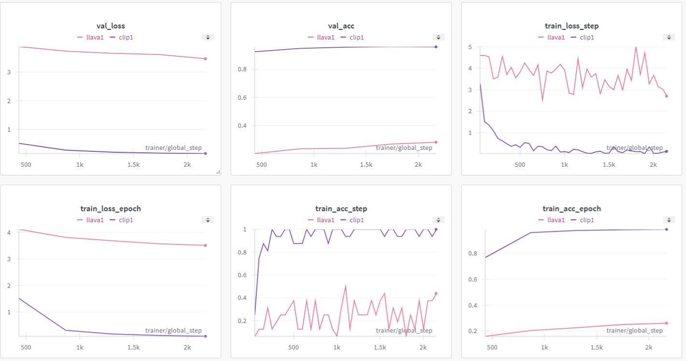

# clip-llava
classifying caltech 101 using clip and llava

#### Results

- clip has high final accuracy (~96%) with low validation loss (~0.2)
- llava has low final accuracy (~28%) with high validation loss (~3.5)
- clip outperforms llava for classification of Caltech101, having higher final accuracy and lower validation loss

\* Note: the results, specifically the large disparity in performance, may be explained by the models used. 

For clip, I used the original OpenAI clip model. But for llava, the original "llava-hf/llava-1.5-7b-hf" model has 7 billion parameters, which was too large for the constraints of the free Google Colab plan. I exhausted the RAM limit on every run with this model. Thus, I switched to a tiny LLaVA model with 5 million parameters, which may have impacted performance.
With more memory, I could fit a larger llava model to test whether this hypothesis is true and if my current findings remain or change.